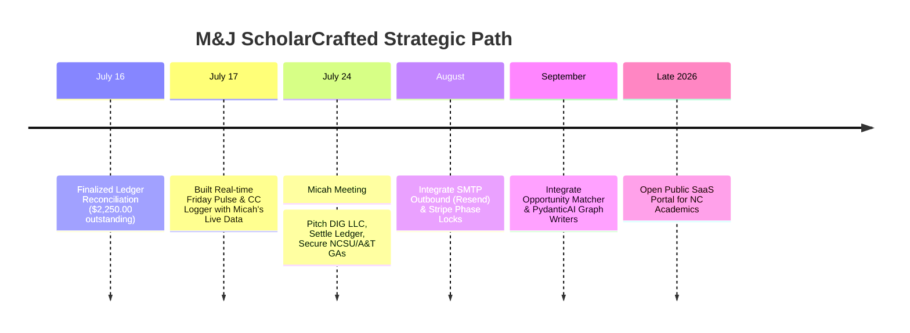

# 🗺️ Master Strategic Roadmap, Feature Registry & Technical Blueprint
## Vance Lab Operations Cockpit & The ScholarCrafted™ SaaS Transition

This master document details the design system, completed features, deliberate engineering shifts (including archived/cancelled specifications), and the roadmap to productization.

---

## 📊 1. Master Feature Registry: Complete Status Matrix

We have aligned our operational plans in [docs](file:///home/miseda/Documents/projects/consulting-business/docs) with active codebases. Here is our official feature log:

| Functional Area | Feature & Architecture | Target Tier | Status | Origin / Rationale (from @docs) |
| :--- | :--- | :---: | :---: | :--- |
| **Database Core** | Payload 3.0 TypeScript CMS | Tier 1 | ❌ **CANCELLED** | Replaced with Go/PocketBase due to type instability, compilation delays, and schema bloat. |
| **Database Core** | PocketBase Custom Go Server | Tier 1 | 🟢 **COMPLETED** | Solid, ultra-lightweight Go SQLite engine with secure row-level client sandbox rules. |
| **Intake Pipeline** | "The Scholar's Diagnostic" | Tier 3 | 🟡 **PENDING** | Gated diagnostic path on the public landing page to capture research field and pain points. |
| **Intake Pipeline** | "Convert Lead" Lifecycle Promotion | Tier 1 | 🟢 **COMPLETED** | Single-click lead promotion (creates Client account, maps new Projects, logs audit trails, clears queue). |
| **Task Management** | Chapter-by-Chapter Sprints | Tier 1 | 🟢 **COMPLETED** | Modular progressive delivery of books and grants rather than big, chaotic single files. |
| **File Management** | Sandboxed "File Vault" (Media) | Tier 1 | 🟢 **COMPLETED** | Sandboxed folder cabinet supporting manuscript drafts, guidelines, and `.bib` bibliographies. |
| **File Management** | In-Browser Typst Monaco Editor | Tier 1 | ❌ **ARCHIVED** | Moved to future SaaS. Academics prefer writing in Word/Markdown; forcing them into Monaco editors was a friction point. |
| **Communication** | Outbound "Clearance Buffer" | Tier 2 | 🟢 **COMPLETED** | Staged outbound emails glow as `pending_approval` inside your cockpit as an operational buffer. |
| **Communication** | Inbound "CC" Mailbox Logger | Tier 2 | 🟢 **COMPLETED** | Fuzzy-matches mobile forwards from Micah's phone (e.g. from NCSU mail client) directly to projects in real-time. |
| **Communication** | Friday Status Pulse Compiler | Tier 2 | 🟢 **COMPLETED** | Automatically audits weekly task updates, synthesizing an elegant, professional progress report. |
| **Communication** | Outbound SMTP / Resend gateway | Tier 2 | 🟡 **PENDING** | Dispatching authorized clearances directly through verified domains (`micah@vance.lab`, `office@vance.lab`). |
| **Integrations** | Zotero "Better BibTeX" Bridge | Tier 2 | 🟢 **COMPLETED** | Ingesting client `.bib` bibliographies directly into the sandboxed project File Vault. |
| **Integrations** | Stripe Payment Webhook Gateway | Tier 2 | 🟡 **PENDING** | Activates phase locks or unlocks next chapters upon receiving `payment_intent.succeeded`. |
| **Intelligence** | Opportunity Matcher Engine | Tier 2 | 🟡 **PENDING** | Automated scraper parsing CFP RSS feeds and grants, matching keywords to client interests. |
| **Intelligence** | Bespoke AI Manuscript Graphs | Tier 2 | 🟡 **PENDING** | PydanticAI / LangGraph workflows translating outline briefs into citation-rich drafts. |
| **Intelligence** | Typst WASM Scholar Report | Tier 2 | 🟡 **PENDING** | Monthly typeset report compilation ready for Tenure Boards and Graduate Deans. |
| **Public Profiles** | Sovereign Portfolio Sites | Tier 3 | 🟡 **PENDING** | Public impact showcases displaying dynamic timelines of completed projects. |

---

## 📂 2. Core Collections Schema Blueprint (PocketBase Core)

All core schemas have been fully declared and compiled in `backend/main.go` and verified via client access controls.

### 👤 A. `users` (System Accounts)
*   **Fields**: `id`, `email`, `name`, `roles` (`["client"]`, `["admin"]`, `["lead_researcher"]`), `institution`, `academicNiche`, `keywords` (research interest tags), `sentimentScore` (health indicator).
*   **Access Rules**: Users read and write only their own records. Admins have absolute master CRUD rights.

### 📂 B. `projects` (Consulting engagements / book proposals)
*   **Fields**: `id`, `title`, `slug`, `client` (relation → `users`), `leadResearcher` (relation → `users`), `publisher`, `status`, `progress`, `nextMilestone`, `sentimentScore`, `showOnPortfolio`, `lastContactAt`, `units` (chapter trackers).
*   **Access Rules**: Restricted to matched clients, assigned researchers, and admins.

### 📋 C. `tasks` (Actionable Milestones)
*   **Fields**: `id`, `project` (relation → `projects`), `assignedTo` (relation → `users`), `title`, `description`, `status`, `priority`, `due`.
*   **Access Rules**: Read by project participants; write restricted to researchers and admins.

### ✉️ D. `correspondence` (The Communication Log)
*   **Fields**: `id`, `project`, `author`, `target` (`client`, `publisher`, `other`), `recipientEmail`, `subject`, `content`, `status` (`draft`, `pending_approval`, `sent`), `sentAt`.
*   **Access Rules**: Project sandboxed.

### 📁 E. `media` (The Scholarly File Vault)
*   **Fields**: `id`, `project`, `file` (upload), `label`, `fileType` (`manuscript_draft`, `peer_review`, `journal_guideline`, `bibliography_bib`), `version`, `source`, `visibility` (`internal`, `client_shared`).
*   **Access Rules**: Non-researchers can only view files where `visibility = "client_shared"`.

### 📬 F. `leads` (Onboarding Pipeline)
*   **Fields**: `id`, `name`, `email`, `university`, `documentType`, `projectStatus`, `targetPublisher`, `primaryPainPoint`, `howHeard`, `status`, `priority`, `notes`.
*   **Access Rules**: Admin-only read/write.

---

## 🛠️ 3. Analysis of Key Engineering Pivots (The "Why")

### 1. Ditching Payload CMS for PocketBase Go Core
*   **The Issue**: The previous Payload CMS implementation suffered from severe compilation delays, TypeScript type conflicts on database hooks, and unstable schema updates.
*   **The Shift**: We compiled a single, high-performance Go binary combining **PocketBase v0.39.6** and custom Echo API handlers.
*   **The Benefit**: Startup times dropped to milliseconds, databases are stored in robust, single-file SQLite databases (`pb_data/data.db`), and we write atomic database hooks natively in Go, guaranteeing 100% thread safety and instant reaction times.

### 2. Archiving the Client-Facing WASM Monaco Editor Studio
*   **The Issue**: Our initial feature blueprint planned for clients and writers to type their manuscripts live inside a custom browser pane using Monaco Editor and Typst WASM.
*   **The Shift**: We recognized that forcing academic researchers out of their native environments (Word, Google Docs, local Markdown editors like Obsidian) introduced immense onboarding friction.
*   **The Benefit**: We archived the in-browser Monaco Editor. Instead, clients write in their preferred formats and upload files to the **File Vault (Media)**. Vance Lab performs the elite Typst layout formatting locally in our CLI, delivering pixel-perfect PDF galley proofs.

### 3. Progressive Module Chapters over Giant Files
*   **The Issue**: Academic projects are historically delayed because editors wait to review the *entire* completed draft, causing months of dead silence.
*   **The Shift**: We structured book manuscripts and applications into modular, progressive units (stored in the `units` JSON field).
*   **The Benefit**: We can write, format, typeset, and clear Chapter 1 while Chapter 2 is still being researched, ensuring a continuous loop of value delivery.

---

## 📅 4. Strategic Business Timeline (July 24th Meeting & Beyond)

### 🎯 July 24th Corporate Alignment Goals:
1.  **DIG, LLC Registration**: Incorporate **Dobson Innovation Group, LLC (DIG)** in North Carolina. Register **M&J ScholarCrafted™** as an active DBA brand running under DIG. This houses all consulting operations under a single corporate umbrella.
2.  **Clear the Ledger**: Secure the outstanding consulting ledger balance of **$2,250.00** up to July 16, 2026.
3.  **GA Admissions Leverage**: Use this active running Cockpit prototype (complete with Micah's actual projects, tasks, and real-time CC simulator) to demonstrate technical capabilities to NC State or NC A&T Graduate Directors, securing tuition-waiving Graduate Assistantships (GAs).
