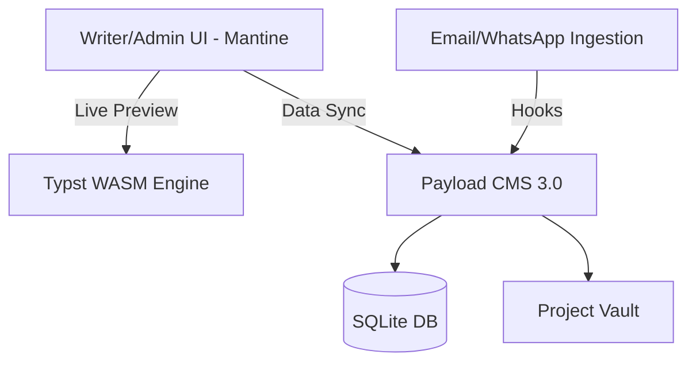

# 01: Tech Stack Architecture - The Consulting OS

## Core Infrastructure (The Lean Monolith)
We leverage **Payload 3.0 (Next.js App Router)** not just as a CMS, but as a full **Application Framework**. This allows us to build a specialized Consulting Operating System within a single codebase.

### 1. The Foundation: Payload 3.0 + Next.js
- **Framework:** Next.js (App Router).
- **CMS/Backend:** Payload 3.0 (Code-first schema).
- **Forms:** Payload Native Form Builder (`@payloadcms/plugin-form-builder`).
- **Database:** SQLite (Single file, local VFS for portability).
- **Storage:** Cloudflare R2 (S3-compatible, Zero Egress Fees).
- **Comms:** Resend BYOK (React Email + API).
- **Why this approach?** By using a code-driven CMS and sovereign cloud storage, we own the data and eliminate scaling "taxes." It eliminates the "UI friction" of external tools.

### 2. The Frontend Strategy: Tiered Access
- **Admin Command Center (You & Micah):** A premium, enterprise-grade dashboard built with **Mantine v7**. This is where "Business Intelligence" and "Production Control" happen.
- **Writer's Portal:** A focused, two-pane partitioned view (Markdown Editor | Typst WASM Preview).
- **Public Website:** The "Gate." Uses default Next.js/Tailwind for marketing, blog, and the **Onboarding Hook**.

### 3. The "Superior" Rendering Engine: Typst WASM
- **Technology:** WebAssembly (WASM).
- **Implementation:** The Typst compiler is loaded directly into the user's browser tab.
- **The Template Registry:** A centralized library of Publisher-Specific "Molds" (Routledge, CRC Press, Nature). These templates wrap the raw Markdown into elite, publisher-ready PDFs instantly.
- **Value Proposition:** 
    - **Instant Preview:** Millisecond rendering as the user types (No server lag).
    - **Privacy:** Data is compiled locally in the browser; sensitive research never leaves the secure session for rendering.
    - **Scalability:** The client's hardware does the heavy lifting, keeping our server "Lean."

## Deployment Architecture

## Benefits
- **Zero-Touch Ops:** No external database or heavy rendering clusters.
- **AI-First DX:** Since the schema is TypeScript, AI can generate complex logic and custom views effortlessly.
- **Portability:** The entire business (Logic + Data + Engine) lives in one portable Docker container.
